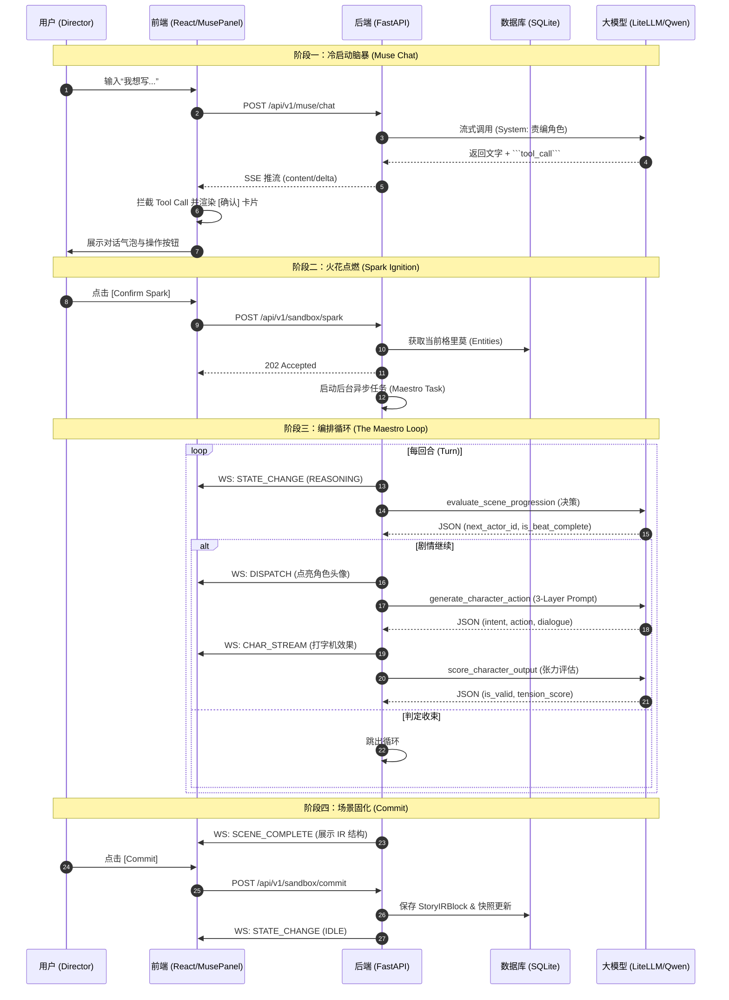

# 🏗️ Genesis Engine: AI-Native System Specifications (SPEC)

**版本:** v2.0 (Web Novel Workshop Edition)
**前置文档:** PRD_Genesis.md, Architecture_Design.md, USER_PERSONA.md
**状态更新:** V1.0 核心推演链路已打通，**V1.1 网文作坊版规划中**

**状态标记说明:**
- ✅已实现 — V1.0 已上线
- 🆕V1.1 — 网文作坊版新增（本版新增条目）
- 🏗️已规划 — Schema 已定义，实现中
- 📋V2.0+ — 后续版本

---

## 1. 全局数据字典 (Data Dictionary & Schemas) [✅已实现]
*(参见: Architecture_Design.md §2.4, PRD_Genesis.md §5.3)*

### 1.1 实体重定义 (Entity - The Grimoire) [✅已实现]
系统设定的核心载体，存储于单体 SQLite 中。

### 1.2 脱水剧本块 (Story IR Block) [🏗️逻辑已建立]
推演循环的最终产物。**推演逻辑层面不可变**；仅 `content_html` 可被 Camera 渲染/用户精修覆写。

### 1.3 推演输入源 (The Spark) [✅已实现]
启动并控制一次编排循环 (Orchestration Loop) 的全局参数。

### 1.4 世界观快照与分支 (Snapshot & Branch) [🏗️Schema已建立]
支撑时间倒流和多线剧情的底层数据结构。

### 1.5 大纲树节点 (StoryNode) [✅已实现]
左侧导航栏的骨架。

### 1.6 渲染请求 (RenderRequest) [🏗️Schema已建立]
Camera Agent 的输入参数，用于控制文学渲染的视角与风格。

**字段定义:**
| 字段 | 类型 | 说明 |
|------|------|------|
| `ir_block_id` | string | 待渲染的 IR Block UUID |
| `pov_type` | POVType | 视角类型：`OMNISCIENT`(全知) / `FIRST_PERSON`(第一人称) / `CHARACTER_LIMITED`(角色限制) |
| `pov_character_id` | string? | 当 POV 为限制视角时，指定角色 UUID |
| `style_template` | string | 文风模板名称或自定义锚点文本 |
| `subtext_ratio` | float (0.0-1.0) | 潜台词密度：0=纯白描，1=极致意识流 |

**POVType 枚举:**
- `OMNISCIENT` — 上帝视角，全知叙述
- `FIRST_PERSON` — 第一人称，"我"的叙述
- `CHARACTER_LIMITED` — 角色限制视角，第三人称但仅呈现该角色所知

### 1.7 Maestro 决策输出 [✅已实现]
**特性**: 增加冗余 JSON 容错解析、字段自动映射补丁、Markdown 块自动清洗。

### 1.8 角色动作输出 [✅已实现]
**特性**: 增加 `inner_monologue` -> `intent` 等常见模型幻觉字段映射。

### 1.9 全局配置 (ProjectSettings) [✅已实现 + 🆕V1.1 字段扩展]

独立于世界观之外，用于存储单机运行时用户设定的偏好与大模型秘钥。

**V1.1 新增字段:**
| 字段 | 类型 | 说明 |
|------|------|------|
| `target_platform` | PlatformProfile | 目标平台，见 §1.15 |
| `default_target_char_count` | int | 默认章节字数（起点 3000 / 番茄 2500 / 晋江 4000） |
| `default_max_sent_len` | int | 默认最大句长 |
| `ending_hook_guard_enabled` | bool | 钩子守卫开关（默认 true） |
| `padding_detector_enabled` | bool | 水字数检测开关（默认 true） |
| `daily_streak_count` | int | 连续日更天数（Commit 触发更新） |
| `last_commit_at` | datetime | 上次 Commit 时间（超过 24h 重置 streak） |

---

### 1.10 Beat 类型枚举 (BeatType) [🆕V1.1]

**定位**: 替代 V1.0 抽象的"张力评分"判据，让 Maestro 按网文作者声明的戏剧类型做专项判完成。

```python
class BeatType(str, Enum):
    SHOW_OFF_FACE_SLAP   = "装逼打脸"   # 主角秀操作 + 反派被挫
    PAYOFF               = "爽点兑现"   # 前期铺垫回报
    SUSPENSE_SETUP       = "悬念铺垫"   # 埋未解冲突
    EMOTIONAL_CLIMAX     = "情感升华"   # 感情戏高潮
    POWER_REVEAL         = "金手指展示" # 能力首秀/升级
    REVERSAL             = "反转"       # 形势翻转
    WORLDBUILDING        = "世界观补完" # 新设定曝光
    DAILY_SLICE          = "日常流"     # 种田/过渡章节
```

**Maestro 判完成的 Prompt 模板示例（SHOW_OFF_FACE_SLAP）**:
```
[任务] 判断本 Beat 是否完成
[beat_type] SHOW_OFF_FACE_SLAP（装逼打脸）
[判据要素]
  1. 主角是否展示了具体能力/态度/资源？（必需）
  2. 反派/对立方是否明确被挫？（必需，需有外显文字：表情/动作/台词）
  3. 双方的地位反差是否可感知？（必需）
[最近 N 个 Turn 日志]
  ...
[输出] { "is_beat_complete": bool, "missing_requirements": string[], "next_hint": string }
```

---

### 1.11 角色声音签名 (VoiceSignature) [🆕V1.1]

**定位**: Scribe 级的角色 OOC 防漂移检测。网文角色 OOC 90% 表现为口头禅消失、称谓错乱、语气异化，这三项用**规则检查**（grep 级）就能抓住，不需要 LLM。

**挂载位置**: Entity 表新增 `voice_signature: VoiceSignature | null` 字段（角色类实体必填，其他可空）。

```python
class VoiceSignature(BaseModel):
    catchphrases: list[str]                  # 口头禅。每 N 章至少出现 1 次
    catchphrase_min_freq_chapters: int = 10  # 口头禅频次下限窗口
    honorifics: dict[str, str]               # {对象角色ID或类型: 使用的称谓}
                                             # 如 {"长辈": "您", "平辈": "你", "下属": "你这厮"}
    forbidden_words: list[str]               # 角色绝不说的词（硬约束）
    sample_utterances: list[str]             # 3-5 条范本台词（作者手动标定）
    tone_keywords: list[str]                 # 常用语气副词（"便""倒是""罢了"等）
```

**Scribe 校验流程**:
1. 每个 IRBlock Commit 后，遍历 `action_sequence` 中该角色的所有 `dialogue`。
2. 检查 `forbidden_words` 命中 → **硬失败**，阻断 Commit 并返回 `VOICE_SIGNATURE_VIOLATION` 错误，要求 Character 重生成。
3. 检查 `honorifics` 是否匹配对话对象的角色关系 → 软警告。
4. 检查 `tone_keywords` 覆盖率 → 累计统计，跨章节漂移检测（V2.0 使用）。
5. 检查 `catchphrases` 频次（滑动窗口 10 章）→ 软警告。

---

### 1.12 章节目标字数 (ChapterTarget) [🆕V1.1]

**定位**: 网文章节字数命中是生死指标，必须是一等公民字段。

**挂载位置**: StoryNode（Chapter 层级）新增字段：

| 字段 | 类型 | 说明 |
|------|------|------|
| `target_char_count` | int | 目标字数（默认继承 ProjectSettings.default_target_char_count） |
| `tolerance_ratio` | float | 容差比例，默认 0.10（±10%） |
| `actual_char_count` | int? | 渲染后实际字数（Commit 时写入） |
| `padding_warnings` | list[str]? | 水字数检测器输出的警告（非阻断） |

**Camera 约束流程**:
1. 渲染完成后 `len(content_html.text_only())` 计数。
2. 偏差 > tolerance_ratio：
    *   偏少 → 以相同 IR 追加渲染，Prompt 追加 `[约束] 需增加约 X 字的环境/心理/景物描写，不得增加新情节/对白/事实`。
    *   偏多 → 以相同 IR 压缩渲染，Prompt 追加 `[约束] 需精简至约 X 字，优先保留对白与动作，砍冗余描写`。
3. 重试最多 3 次。3 次仍不达标时返回实际字数，由作者手动决定。

---

### 1.13 软层补丁 (SoftPatch / FactRevision) [🆕V1.1]

**定位**: 作者手动修订事实的数据层。**不改历史快照**，只在当前 `Grimoire.current_state` 指针上挂 delta。下次 Commit 时随新快照一起持久化。

**Schema**:
```python
class SoftPatch(BaseModel):
    patch_id: str                    # UUID
    target_entity_id: str
    target_path: str                 # JSONPath，如 "stats.gold" 或 "relationships.ning_yi"
    old_value: Any
    new_value: Any
    author_note: str                 # 作者改动原因（"原文 3000 两错了，应该 300 两"）
    created_at: datetime
    merged_into_snapshot_id: str?    # 合并入快照后填充；未合并时为 null
```

**生命周期**:
1. 作者选段右键 `[告诉 Muse 这里改了事实]` → 对话 → Muse 生成 `SoftPatch` 候选。
2. 用户确认 → 写入 `soft_patches` 表，状态 pending。
3. 下一次 Commit 时：所有 pending SoftPatch 合并进新快照，打标 `merged_into_snapshot_id`。
4. 合并后视为历史的一部分，不可再撤销（符合快照链不可变性）。
5. 未合并前的 SoftPatch **可自由撤销**（作者反悔）。

**查询优先级**: Grimoire 读取时，先读当前快照，再 overlay 所有 pending SoftPatch。

---

### 1.14 场景层级 (Scene) [🆕V1.1]

**背景**: 原始架构 `StoryNode(Chapter) → IRBlock` 是一对一。网文章节常有 2-3 个场景切换（日常/冲突/钩子），塞进一个 Beat 会让 Camera 渲染平淡。

**新层级**: `Chapter → Scene[] → IRBlock`。每个 Scene 是一次独立的 Spark + 推演闭环。

**Schema**:
```python
class Scene(BaseModel):
    scene_id: str
    chapter_id: str                  # 所属章节
    lexorank: str                    # Scene 在 Chapter 内的顺序
    spark: TheSpark                  # 本场推演的 Spark（含 beat_type）
    ir_block_id: str?                # 推演产生的 IR Block
    state: SceneState                # PENDING / RUNNING / EMITTED / COMMITTED
```

**Camera 渲染时序**:
- 单 Scene 渲染：生成该 Scene 的 HTML。
- **Chapter 级 Render All**：按 lexorank 拼接所有 Scene 的 IR Block，**一次性喂给 Camera**，保证全章文风连贯。target_char_count 在 Chapter 层约束。

**向下兼容**: V1.0 的"一章一场"项目视为每章只挂 1 个 Scene。迁移脚本自动生成。

---

### 1.15 平台预设 (PlatformProfile) [🆕V1.1]

```python
class PlatformProfile(str, Enum):
    QIDIAN       = "起点中文网"    # 爽文/打脸/热血
    FANQIE       = "番茄小说"      # 短句/节奏快/爽点密集
    JINJIANG     = "晋江文学城"    # 情感/细腻/心理描写
    ZONGHENG     = "纵横中文网"    # 权谋/军事/历史
    QIMAO        = "七猫 / 飞卢"   # 短平快/流水账爽文
    CUSTOM       = "自定义"        # 用户自定参数
```

**每个预设对应一组默认值**（存于 `backend/prompts/platform_profiles.yaml`）:
```yaml
QIDIAN:
  subtext_ratio: 0.2
  style_template: "热血爽文"
  max_sent_len: 30
  default_char_count: 3000
  scene_pacing_hint: "高能章每 3 章 1 次"
FANQIE:
  subtext_ratio: 0.15
  style_template: "快节奏爽文"
  max_sent_len: 20
  default_char_count: 2500
  scene_pacing_hint: "每章至少 1 个爽点"
JINJIANG:
  subtext_ratio: 0.6
  style_template: "江南烟雨"
  max_sent_len: 40
  default_char_count: 4000
  scene_pacing_hint: "情感线优先"
```

---

### 1.16 爽点节奏表 (PayoffRhythm) [📋V2.0]

**定位**: 跨章节追踪 beat_type 分布，为 Muse 提供"该来一场打脸了"的主动提醒输入。

```python
class ChapterBeatLog(BaseModel):
    chapter_id: str
    lexorank: str
    beat_types: list[BeatType]      # 本章所有 Scene 的 beat_type
    committed_at: datetime

# 查询逻辑：
# - 连续 5 章都是 DAILY_SLICE / WORLDBUILDING → Muse 提醒
# - 单章同时含 SHOW_OFF_FACE_SLAP + POWER_REVEAL → 🔥 标记
```

---

## 2. 核心状态机 (State Machine & Concurrency) [✅V1.0 已实现 + 🆕V1.1 扩展]

### 2.1 Sandbox State Enum

**V1.0 状态（9 个）**：

| 状态 | 说明 | 触发条件 |
|------|------|----------|
| `IDLE` | 空闲态 | 初始状态 / Commit 后归零 |
| `SPARK_RECEIVED` | 火花已接收 | POST /sandbox/spark 成功 |
| `REASONING` | 推理决策中 | Maestro 评估场景走向 |
| `CALLING_CHARACTER` | 调用角色中 | 等待 Character Agent 响应 |
| `EVALUATING` | 评估中 | Maestro 对角色输出打分 |
| `EMITTING_IR` | 输出 IR | 场景收束，生成 Story IR Block |
| `RENDERING` | 渲染中 | Camera Agent 生成文学正文 |
| `COMMITTED` | 已提交 | 用户确认，快照已落盘 |
| `INTERRUPTED` | 已中断 | 用户 CUT 或异常终止 |

**🆕V1.1 新增状态（4 个）**：

| 状态 | 说明 | 触发条件 |
|------|------|----------|
| `CHAR_COUNT_ADJUST` | 字数约束调整中 | Camera 首轮渲染完但字数不达标 |
| `HOOK_GUARDING` | 钩子守卫检测中 | Camera 渲染完成后自动进入 |
| `HOOK_REFINING` | 只重渲染章末 | 钩子守卫判定不合格 |
| `VOICE_CHECKING` | 角色声音校验中 | Scribe 入口，Commit 前 |

**状态转移主路径 (V1.1)**：
```
IDLE → SPARK_RECEIVED → REASONING ⇄ CALLING_CHARACTER ⇄ EVALUATING
                                                           ↓
                                     EMITTING_IR → RENDERING
                                                     ↓
                                          CHAR_COUNT_ADJUST (循环 ≤3 次)
                                                     ↓
                                          HOOK_GUARDING
                                          ↙         ↘
                                   HOOK_REFINING    VOICE_CHECKING
                                          ↓            ↓
                                          └──→ COMMITTED → IDLE
                                                     ↘ INTERRUPTED → IDLE
```

---

## 3. 程序化编排算法 (Programmatic Orchestration Logic) [✅已实现]
### 3.1 The Maestro Loop (Python Implementation) [✅已实现]
*   **状态广播**: 通过 WebSocket 实时同步。
*   **3-Layer Prompt**: 严格按照 System/Scene/Director 三层合成。
*   **上帝指令注入 (Override)**: 支持在回合间隙消费指令。
*   **强制收束 (Max Turns)**: 具备兜底退出逻辑。

### 3.2 交互与推演时序图 (Interaction Sequence Diagram) [✅已实现]



---

## 4. 前后端通信契约 (IPC Protocols)

### 4.1 REST API (统一前缀 `/api/v1/`)

**The Muse 代理网关 (The Muse Gateway) [✅已实现]**
*   **POST** `/api/v1/muse/chat` -> ✅ **SSE 流式响应**。
*   **Tool Call 拦截**: 支持在回复中嵌入 ````tool_call` 代码块，前端自动渲染为确认卡片。

**大纲树与时光机 (Storyboard & History) [✅已实现]**
*   **GET/POST** `/api/v1/storyboard/nodes` -> 完成基本 CRUD。

**推演沙盒控制流 (Sandbox Controls) [✅已实现]**
*   **GET** `/api/v1/sandbox/state` -> 完成。
*   **POST** `/api/v1/sandbox/spark` -> 完成（**含前置角色存在性检查拦截**）。
*   **POST** `/api/v1/sandbox/commit` -> 完成。

**全局系统设置 (Project Settings) [✅已实现]**
*   **GET/PATCH** `/api/v1/settings` -> 完成。

**世界观 CRUD (The Grimoire Management) [✅已实现]**
*   **POST/PATCH/DELETE** `/api/v1/grimoire/entities` -> 完成。

### 4.2 WebSocket 信道 (推演状态流与面板监控) [✅已实现]
**连接端点**: `ws://{host}/ws` (已修正路径与代理映射)
*   **下行事件**: 实现了 `STATE_CHANGE`, `TURN_STARTED`, `DISPATCH`, `CHAR_STREAM`, `SYS_DEV_LOG`, `ERROR`, `SCENE_COMPLETE`。
*   **上行消息**: `Action: CUT` 已实现。

---

## 5. 组装契约与架构隔离 [✅已实现]
### 5.1 隔离红线 (The Iron Wall)
*   **Character**: 禁止第三人称描写。
*   **Maestro**: 仅输出结构化决策。
*   **Robust Parser**: 解决了 Qwen/Llama 等非 OpenAI 模型输出不标准的问题。

### 5.2 3-Layer Prompt 强制组装公式 [✅已实现]

---

## 5.3 Camera Agent 接口定义 [✅V1.0 + 🆕V1.1 字数约束]

**职责:** 将 Story IR Block 渲染为文学正文。Camera 是唯一接触"文学表达"的 Agent。

**输入:**
| 参数 | 来源 | 说明 |
|------|------|------|
| `ir_block` | StoryIRBlock | 脱水剧本块，包含 action_sequence |
| `render_request` | RenderRequest | POV、Style、Subtext 参数 + V1.1 新字段 |
| `grimoire_context` | Entity[] | 相关角色的设定信息 |

**🆕V1.1 扩展 RenderRequest 字段:**
| 字段 | 类型 | 说明 |
|------|------|------|
| `target_char_count` | int? | 目标字数硬约束 |
| `max_sent_len` | int? | 最大句长（平台预设注入） |
| `adjust_mode` | Literal["expand","shrink"]? | 字数调整模式（首次渲染为 null；重试时填） |

**输出:**
- `content_html: string` — 渲染后的 HTML 格式文学正文
- `actual_char_count: int` — 实际字数（Camera 返回时计数）
- `padding_warnings: list[str]` — 水字数检测结果

**API 端点:**
- `POST /api/v1/render` — 提交渲染请求 ✅
- `POST /api/v1/render/{block_id}/retry` — 重试渲染（IR 不变） ✅
- `POST /api/v1/render/{block_id}/refine_ending` — 🆕V1.1 只重渲染章末（钩子守卫触发）
- `POST /api/v1/render/{block_id}/adjust_length` — 🆕V1.1 字数调整（内部状态机调用）

**Prompt 模板结构（V1.1）:**
```
[System] 你是专业的中文网文渲染引擎 Camera...
[POV] 当前视角：{pov_type}，{pov_character}...
[Style] 文风锚点：{style_template}（平台：{platform_profile}）...
[Subtext] 潜台词密度：{subtext_ratio}...
[字数约束] 目标 {target_char_count} 字（±10%）；最大句长 {max_sent_len}
[IR] 以下是需要渲染的剧情骨架：{ir_block_json}

[调整指令] 当前字数不足，需追加约 {delta} 字的环境/心理/景物描写。不得增加新情节/对白/事实。

[调整指令] 当前字数超标，需精简至约 {target_char_count} 字。优先保留对白与动作。

```

---

## 5.4 Ending Hook Guard [🆕V1.1]

**职责:** 检测章末 200 字是否有悬念/钩子，不合格则只重渲染结尾。

**触发时机:** Camera 字数约束通过后、Scribe 入口前。

**Prompt 模板:**
```
[任务] 判断以下章末 200 字是否具备"网文钩子"要素
[判据] 是否出现以下至少一项？
  1. 未解冲突（角色面临抉择/威胁/谜题）
  2. 新入场人物/事件（打破当前平衡）
  3. 反转（形势突变、信息揭露）
  4. 悬念对白（含 "……" "竟然" "不料" 等悬念词汇 + 未完结动作）
[文本] {last_200_chars}
[输出] { "has_hook": bool, "hook_type": string?, "reason": string }
```

**不合格时的 refine 逻辑:**
- 保留 IR Block 不变。
- 取最后一个 ActionEntry 重新渲染其 content，Prompt 追加：
  ```
  [强约束] 本段为章末，必须留钩子。建议方向：{hook_suggestion}
  ```
- 重试上限 3 次。

---

---

## 5.4 Muse Tool Call Schema [✅已实现]

The Muse 通过 `tool_call` 代码块与前端交互。前端解析后渲染确认卡片。

**Tool Call 格式:**
```json
{
  "action": "<action_type>",
  "payload": { ... }
}
```

**已实现的 Actions (V1.0):**

| Action | Payload | 说明 | 前端处理 |
|--------|---------|------|----------|
| `create_entity` | Entity 对象 | 创建角色/势力/地点 | `grimoireApi.createEntity()` |
| `update_entity` | `{entity_id, updates}` | 修改实体属性 | `grimoireApi.updateEntity()` |
| `delete_entity` | `{entity_id}` | 软删除实体 | `grimoireApi.deleteEntity()` |
| `query_memory` | `{query}` | 查询 Grimoire 状态 | `grimoireApi.queryEntities()` |
| `start_spark` | TheSpark 对象 | 启动推演 | `sandboxApi.triggerSpark()` |

**V2.0 Actions (已实现):**

| Action | Payload | 说明 |
|--------|---------|------|
| `override_turn` | `{spark_id, entity_id, directive}` | 微操推演 |
| `adjust_render` | `{subtext_ratio?, style_template?, pov_type?}` | 调整渲染参数 |
| `create_branch` | `{name, origin_snapshot_id?, parent_branch_id?}` | 创建平行分支 |
| `rollback` | `{snapshot_id}` | 回档到指定快照 |

**🆕V1.1 Actions:**

| Action | Payload | 说明 | Muse 档位 |
|--------|---------|------|---------|
| `unblock_writer` | `{}` | [卡文救急] — 基于最近 5 章 + Grimoire 生成 3 个 Spark 候选 | 写稿档 |
| `apply_soft_patch` | `{target_entity_id, target_path, new_value, author_note}` | 事实修订软层补丁 | 设定档 |
| `switch_platform_profile` | `{profile: PlatformProfile}` | 切平台预设（Render Mixer 默认值全换） | 写稿档 |
| `adjust_length` | `{target_char_count}` | 调整本章/场目标字数 | 写稿档 |

---

## 5.5 Muse 双模路由 [🆕V1.1]

**背景**: 单一 system prompt + 15+ tool 在中小模型下幻觉率极高。V1.1 拆为两档。

**写稿档 (default, "write" mode)**: 暴露 6 个工具
```python
WRITE_MODE_TOOLS = [
    "generate_spark",       # Spark 候选生成
    "unblock_writer",       # [卡文救急]
    "override_turn",        # 推演微操
    "adjust_render",        # 渲染参数
    "switch_platform_profile",
    "query_memory",         # Grimoire 查询
]
```

**设定档 ("setting" mode, 用户打 `/设定` 或 UI 切换)**: 暴露 7 个工具
```python
SETTING_MODE_TOOLS = [
    "create_entity",
    "update_entity",
    "delete_entity",
    "apply_soft_patch",
    "create_branch",
    "rollback",
    "query_memory",         # 两档都有
]
```

**隐式路由（V2.0 优化）**: 用户输入首句关键词识别意图，如 "加一个" "删除" "回到第 X 章" → 自动弹出"切到设定档"建议。

**System Prompt 头部按档位切换**:
```jinja2

你是网文作者的贴身责编。专注于：生成灵感、微操推演、调渲染参数。
不要主动提议改设定/角色，那需要用户切到"设定档"。

你是网文作者的设定管理员。专注于：实体 CRUD、事实修订、分支/回档。
操作前必须 Markdown 展示 diff 并请用户确认。

```

---

## 5.6 Scratchpad 持久化 [🆕V1.1]

**背景**: V1.0 的 Scratchpad 仅在 FastAPI 进程内存。进程崩溃 = 推演全丢。

**新机制**: 每个 Turn Log 追加到 `scratchpad.jsonl` (与 `grimoire.sqlite` 同目录)。

**格式**:
```jsonl
{"trace_id": "uuid", "spark_id": "uuid", "turn": 1, "state": "CALLING_CHARACTER", "actor_id": "ning_yi", "payload": {...}, "ts": "2026-04-24T10:15:32Z"}
{"trace_id": "uuid", "spark_id": "uuid", "turn": 1, "state": "EVALUATING", "payload": {...}, "ts": "2026-04-24T10:15:45Z"}
...
{"trace_id": "uuid", "spark_id": "uuid", "event": "COMMITTED", "ts": "2026-04-24T10:20:10Z"}   # 标记结束
```

**启动恢复**:
1. FastAPI 启动时扫描 `scratchpad.jsonl`。
2. 按 `trace_id` 聚合，过滤掉已有 `COMMITTED` / `INTERRUPTED` 结束事件的。
3. 剩余的挂起推演：写入 `sandbox_recovery` 表，UI 启动时提示"检测到未完成的推演，要恢复吗？"

**定期清理**: Commit 时截断该 trace 相关行；每天启动时压缩一次。

---

**前端解析逻辑 (MusePanel.tsx):**
```typescript
const toolCallMatch = msg.content.match(/```tool_call\n([\s\S]*?)\n```/);
if (toolCallMatch) {
  const toolCallData = JSON.parse(toolCallMatch[1]);
  // 渲染确认按钮
}
```

---

## 6. 物理工程落地拓扑 [✅已实现]
*   **后端**: FastAPI 单体架构，使用 `aiosqlite` (WAL 模式) 和 `litellm`。
*   **前端**: Vite + React + Tailwind，重构了 `MusePanel` 支持交互式 Tool Call。

---

## 7. V2.0 新增组件 [✅已实现]

### 7.1 The Monitor [✅已实现]
**位置**: `frontend/src/components/Monitor.tsx`
**功能**:
- 可折叠面板，显示 Maestro 编排进度
- 订阅 WebSocket 事件：STATE_CHANGE, TURN_STARTED, DISPATCH, CHAR_STREAM, SYS_DEV_LOG, SCENE_COMPLETE, ERROR
- 状态时间线显示（IDLE → SPARK_RECEIVED → REASONING → ...）
- 角色调度日志
- 上帝之手 (God's Hand): 点击回合 → 冻结 → 输入指令 → 释放

### 7.2 RenderMixer [✅已实现]
**位置**: `frontend/src/components/RenderMixer.tsx`
**功能**:
- POV 类型下拉框 (OMNISCIENT / FIRST_PERSON / CHARACTER_LIMITED)
- 风格模板输入框
- 潜台词密度滑块 (0-100%)
- 自动保存到 `/api/v1/render/adjust`

### 7.3 God's Hand / God's Pardon [✅已实现]
**功能**:
- **God's Hand**: 在 Monitor 中点击角色回合 → 进入冻结模式 → 输入新指令 → 释放
- **God's Pardon**: 当 Maestro 拒绝角色动作时，显示 [Override] 按钮

### 7.4 Vector Memory Storage [✅已实现]
**位置**: `backend/crud/memory.py`, `backend/routers/memory.py`
**功能**:
- sqlite-vec 虚拟表 `memory_vectors` (384维向量)
- sentence-transformers/all-MiniLM-L6-v2 嵌入模型
- API: POST /memory, POST /memory/search, DELETE /memory/entity/{id}
