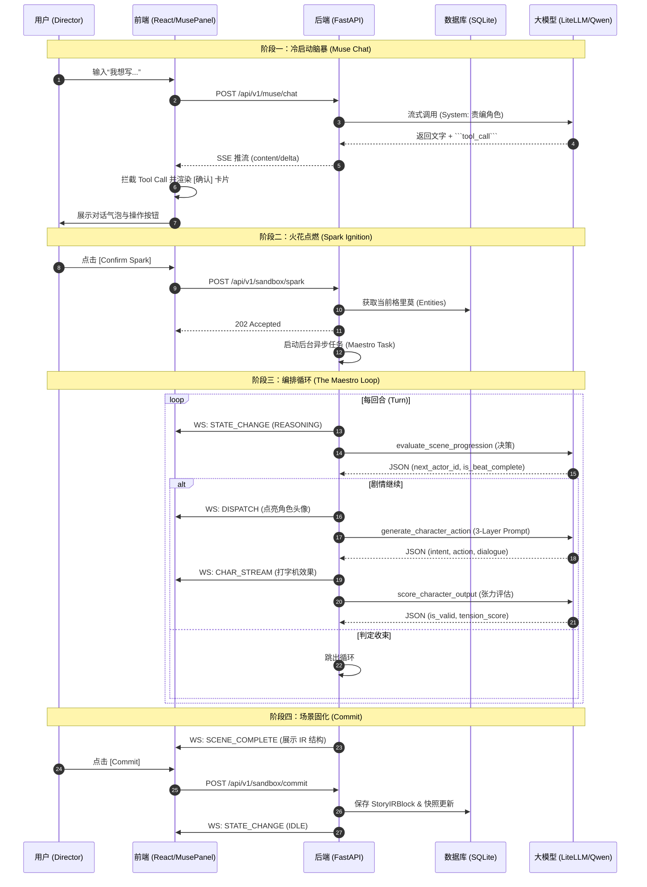

# 🏗️ Genesis Engine: AI-Native System Specifications (SPEC)

**版本:** v1.0 (Occam's Razor Edition)
**前置文档:** PRD_Genesis.md, Architecture_Design.md
**状态更新:** 核心推演链路已打通，Muse 智能助手已上线

---

## 1. 全局数据字典 (Data Dictionary & Schemas) [✅已实现]
*(参见: Architecture_Design.md §2.4, PRD_Genesis.md §5.3)*

### 1.1 实体重定义 (Entity - The Grimoire) [✅已实现]
系统设定的核心载体，存储于单体 SQLite 中。

### 1.2 脱水剧本块 (Story IR Block) [🏗️逻辑已建立]
推演循环的最终产物。**推演逻辑层面不可变**；仅 `content_html` 可被 Camera 渲染/用户精修覆写。

### 1.3 推演输入源 (The Spark) [✅已实现]
启动并控制一次编排循环 (Orchestration Loop) 的全局参数。

### 1.4 世界观快照与分支 (Snapshot & Branch) [🏗️Schema已建立]
支撑时间倒流和多线剧情的底层数据结构。

### 1.5 大纲树节点 (StoryNode) [✅已实现]
左侧导航栏的骨架。

### 1.6 渲染请求 (RenderRequest) [🏗️Schema已建立]
Camera Agent 的输入参数，用于控制文学渲染的视角与风格。

**字段定义:**
| 字段 | 类型 | 说明 |
|------|------|------|
| `ir_block_id` | string | 待渲染的 IR Block UUID |
| `pov_type` | POVType | 视角类型：`OMNISCIENT`(全知) / `FIRST_PERSON`(第一人称) / `CHARACTER_LIMITED`(角色限制) |
| `pov_character_id` | string? | 当 POV 为限制视角时，指定角色 UUID |
| `style_template` | string | 文风模板名称或自定义锚点文本 |
| `subtext_ratio` | float (0.0-1.0) | 潜台词密度：0=纯白描，1=极致意识流 |

**POVType 枚举:**
- `OMNISCIENT` — 上帝视角，全知叙述
- `FIRST_PERSON` — 第一人称，"我"的叙述
- `CHARACTER_LIMITED` — 角色限制视角，第三人称但仅呈现该角色所知

### 1.7 Maestro 决策输出 [✅已实现]
**特性**: 增加冗余 JSON 容错解析、字段自动映射补丁、Markdown 块自动清洗。

### 1.8 角色动作输出 [✅已实现]
**特性**: 增加 `inner_monologue` -> `intent` 等常见模型幻觉字段映射。

### 1.9 全局配置 (ProjectSettings) [✅已实现]
独立于世界观之外，用于存储单机运行时用户设定的偏好与大模型秘钥。

---

## 2. 核心状态机 (State Machine & Concurrency) [✅已实现]
### 2.1 Sandbox State Enum [✅已实现]
推演沙盒的全局状态枚举，共 **9 个状态**：

| 状态 | 说明 | 触发条件 |
|------|------|----------|
| `IDLE` | 空闲态 | 初始状态 / Commit 后归零 |
| `SPARK_RECEIVED` | 火花已接收 | POST /sandbox/spark 成功 |
| `REASONING` | 推理决策中 | Maestro 评估场景走向 |
| `CALLING_CHARACTER` | 调用角色中 | 等待 Character Agent 响应 |
| `EVALUATING` | 评估中 | Maestro 对角色输出打分 |
| `EMITTING_IR` | 输出 IR | 场景收束，生成 Story IR Block |
| `RENDERING` | 渲染中 | Camera Agent 生成文学正文 |
| `COMMITTED` | 已提交 | 用户确认，快照已落盘 |
| `INTERRUPTED` | 已中断 | 用户 CUT 或异常终止 |

**状态转移主路径:**
```
IDLE → SPARK_RECEIVED → REASONING ⇄ CALLING_CHARACTER ⇄ EVALUATING → EMITTING_IR → RENDERING → COMMITTED → IDLE
                                                                                    ↘ INTERRUPTED → IDLE
```

---

## 3. 程序化编排算法 (Programmatic Orchestration Logic) [✅已实现]
### 3.1 The Maestro Loop (Python Implementation) [✅已实现]
*   **状态广播**: 通过 WebSocket 实时同步。
*   **3-Layer Prompt**: 严格按照 System/Scene/Director 三层合成。
*   **上帝指令注入 (Override)**: 支持在回合间隙消费指令。
*   **强制收束 (Max Turns)**: 具备兜底退出逻辑。

### 3.2 交互与推演时序图 (Interaction Sequence Diagram) [✅已实现]



---

## 4. 前后端通信契约 (IPC Protocols)

### 4.1 REST API (统一前缀 `/api/v1/`)

**The Muse 代理网关 (The Muse Gateway) [✅已实现]**
*   **POST** `/api/v1/muse/chat` -> ✅ **SSE 流式响应**。
*   **Tool Call 拦截**: 支持在回复中嵌入 ````tool_call` 代码块，前端自动渲染为确认卡片。

**大纲树与时光机 (Storyboard & History) [✅已实现]**
*   **GET/POST** `/api/v1/storyboard/nodes` -> 完成基本 CRUD。

**推演沙盒控制流 (Sandbox Controls) [✅已实现]**
*   **GET** `/api/v1/sandbox/state` -> 完成。
*   **POST** `/api/v1/sandbox/spark` -> 完成（**含前置角色存在性检查拦截**）。
*   **POST** `/api/v1/sandbox/commit` -> 完成。

**全局系统设置 (Project Settings) [✅已实现]**
*   **GET/PATCH** `/api/v1/settings` -> 完成。

**世界观 CRUD (The Grimoire Management) [✅已实现]**
*   **POST/PATCH/DELETE** `/api/v1/grimoire/entities` -> 完成。

### 4.2 WebSocket 信道 (推演状态流与面板监控) [✅已实现]
**连接端点**: `ws://{host}/ws` (已修正路径与代理映射)
*   **下行事件**: 实现了 `STATE_CHANGE`, `TURN_STARTED`, `DISPATCH`, `CHAR_STREAM`, `SYS_DEV_LOG`, `ERROR`, `SCENE_COMPLETE`。
*   **上行消息**: `Action: CUT` 已实现。

---

## 5. 组装契约与架构隔离 [✅已实现]
### 5.1 隔离红线 (The Iron Wall)
*   **Character**: 禁止第三人称描写。
*   **Maestro**: 仅输出结构化决策。
*   **Robust Parser**: 解决了 Qwen/Llama 等非 OpenAI 模型输出不标准的问题。

### 5.2 3-Layer Prompt 强制组装公式 [✅已实现]

---

## 5.3 Camera Agent 接口定义 [🏗️V2.0规划]

**职责:** 将 Story IR Block 渲染为文学正文。Camera 是唯一接触"文学表达"的 Agent。

**输入:**
| 参数 | 来源 | 说明 |
|------|------|------|
| `ir_block` | StoryIRBlock | 脱水剧本块，包含 action_sequence |
| `render_request` | RenderRequest | POV、Style、Subtext 参数 |
| `grimoire_context` | Entity[] | 相关角色的设定信息 |

**输出:**
- `content_html: string` — 渲染后的 HTML 格式文学正文

**API 端点 (规划):**
- `POST /api/v1/render` — 提交渲染请求
- `POST /api/v1/render/{block_id}/retry` — 重试渲染（IR 不变）

**Prompt 模板结构:**
```
[System] 你是专业的文学渲染引擎 Camera...
[POV] 当前视角：{pov_type}，{pov_character}...
[Style] 文风锚点：{style_template}...
[Subtext] 潜台词密度：{subtext_ratio}...
[IR] 以下是需要渲染的剧情骨架：{ir_block_json}
```

---

## 5.4 Muse Tool Call Schema [✅已实现]

The Muse 通过 `tool_call` 代码块与前端交互。前端解析后渲染确认卡片。

**Tool Call 格式:**
```json
{
  "action": "<action_type>",
  "payload": { ... }
}
```

**已实现的 Actions:**

| Action | Payload | 说明 | 前端处理 |
|--------|---------|------|----------|
| `create_entity` | Entity 对象 | 创建角色/势力/地点 | `grimoireApi.createEntity()` |
| `start_spark` | TheSpark 对象 | 启动推演 | `sandboxApi.triggerSpark()` |

**规划中的 Actions (V2.0):**

| Action | Payload | 说明 |
|--------|---------|------|
| `update_entity` | `{entity_id, updates}` | 修改实体属性 |
| `delete_entity` | `{entity_id}` | 软删除实体 |
| `query_memory` | `{query}` | 查询 Grimoire 状态 |
| `override_turn` | `{spark_id, entity_id, directive}` | 微操推演 |
| `adjust_render` | `{subtext_ratio?, style_template?}` | 调整渲染参数 |
| `create_branch` | `{from_chapter_id, branch_name}` | 创建平行分支 |
| `rollback` | `{snapshot_id}` | 回档到指定快照 |

**前端解析逻辑 (MusePanel.tsx):**
```typescript
const toolCallMatch = msg.content.match(/```tool_call\n([\s\S]*?)\n```/);
if (toolCallMatch) {
  const toolCallData = JSON.parse(toolCallMatch[1]);
  // 渲染确认按钮
}
```

---

## 6. 物理工程落地拓扑 [✅已实现]
*   **后端**: FastAPI 单体架构，使用 `aiosqlite` (WAL 模式) 和 `litellm`。
*   **前端**: Vite + React + Tailwind，重构了 `MusePanel` 支持交互式 Tool Call。
